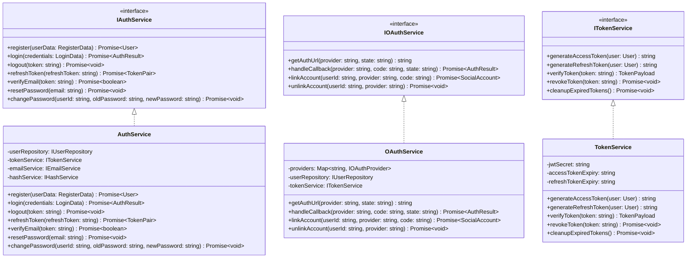
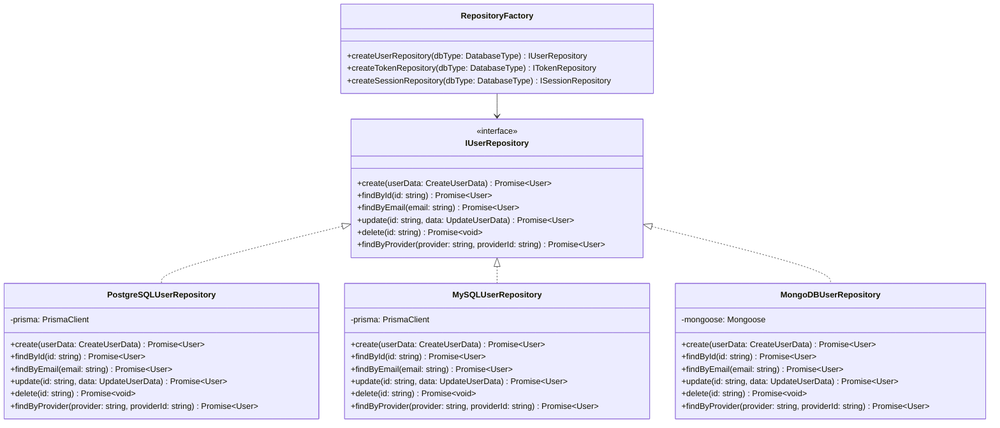
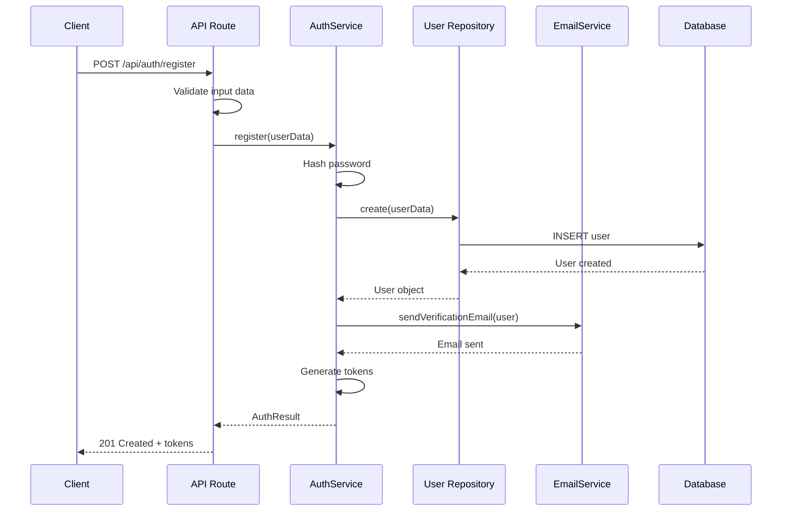
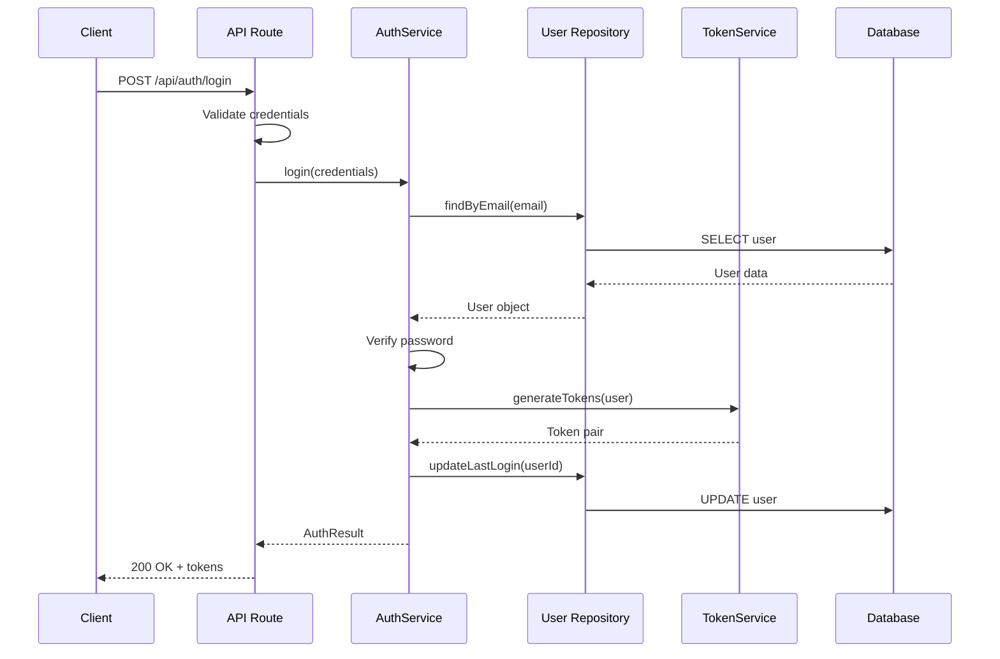
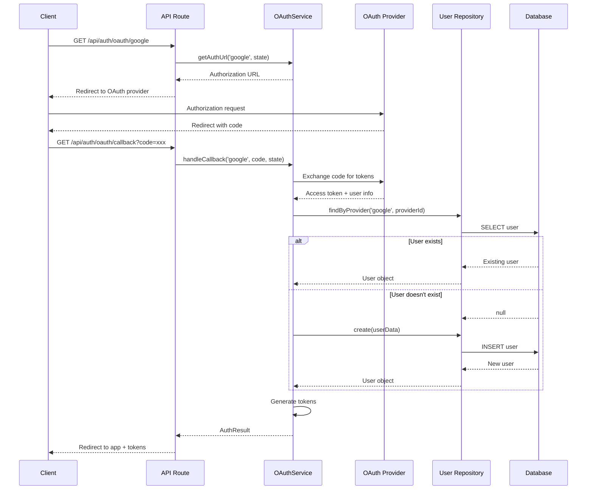
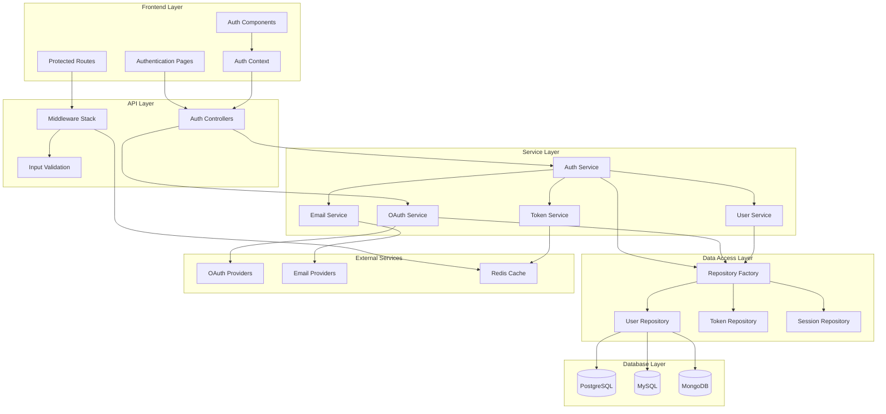
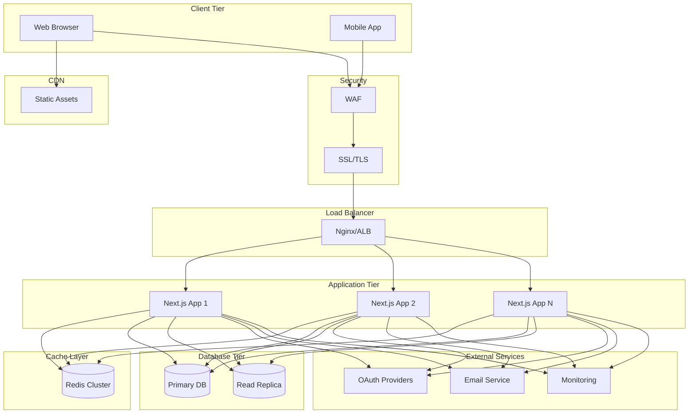
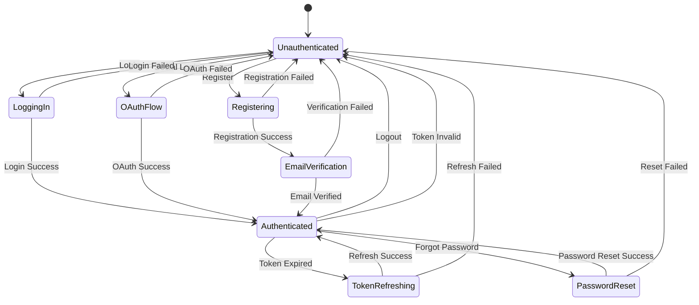
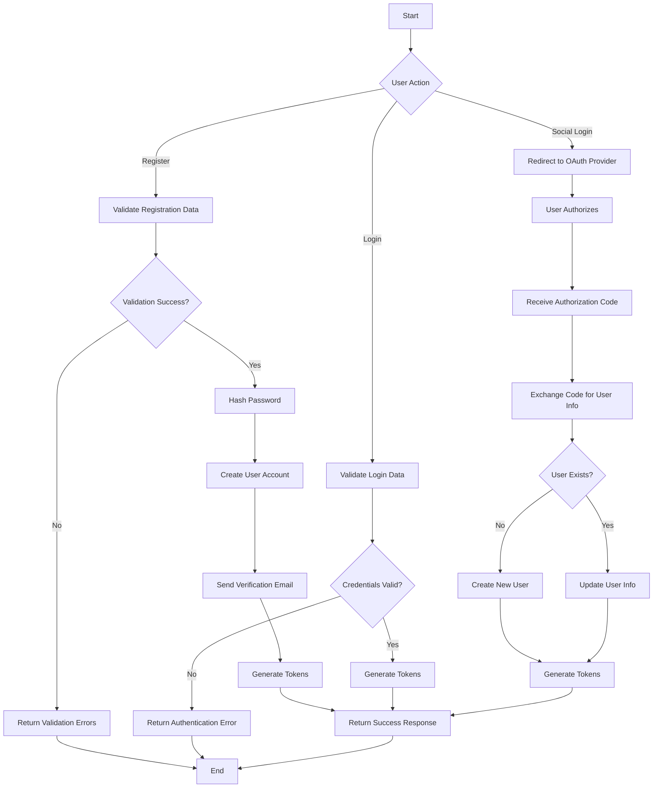

# UML Diagrams - Next.js Authentication Template

## 1. Class Diagram

### Core Authentication Classes

```mermaid
classDiagram
    class User {
        +string id
        +string email
        +string password
        +string firstName?
        +string lastName?
        +string fullName?
        +string role
        +boolean emailVerified
        +Date createdAt
        +Date updatedAt
        +UserProfile profile
        +SocialAccount[] socialAccounts
        +validatePassword(password: string) boolean
        +hashPassword(password: string) string
        +generateTokens() TokenPair
    }

    class UserProfile {
        +string userId
        +string avatar?
        +string bio?
        +string phone?
        +Date dateOfBirth?
        +string timezone?
        +string language
        +boolean twoFactorEnabled
    }

    class SocialAccount {
        +string id
        +string userId
        +string provider
        +string providerId
        +string accessToken?
        +string refreshToken?
        +Date expiresAt?
        +Object providerData
    }

    class AuthToken {
        +string id
        +string userId
        +string token
        +string type
        +Date expiresAt
        +boolean revoked
        +string deviceInfo?
    }

    class AuthSession {
        +string id
        +string userId
        +string deviceId
        +string ipAddress
        +string userAgent
        +Date lastActivity
        +boolean active
    }

    class Role {
        +string id
        +string name
        +string description
        +Permission[] permissions
    }

    class Permission {
        +string id
        +string name
        +string resource
        +string action
        +string description
    }

    User ||--|| UserProfile : has
    User ||--o{ SocialAccount : has
    User ||--o{ AuthToken : has
    User ||--o{ AuthSession : has
    User }o--|| Role : belongs to
    Role ||--o{ Permission : has
```

### Service Layer Classes



### Repository Layer Classes



## 2. Sequence Diagrams

### User Registration Flow



### User Login Flow



### OAuth Authentication Flow



## 3. Component Diagram



## 4. Deployment Diagram



## 5. State Diagram - Authentication States



## 6. Activity Diagram - Complete Authentication Flow



These UML diagrams provide a comprehensive visual representation of the authentication system architecture, showing the relationships between components, the flow of operations, and the deployment structure.